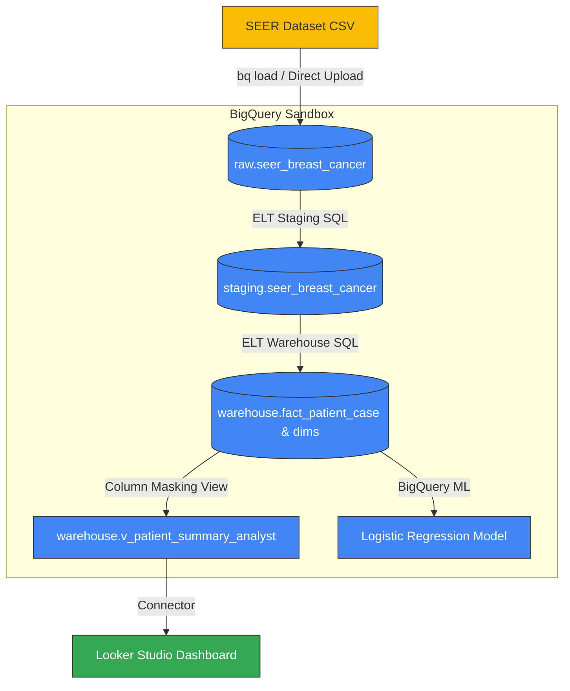

# Breast Cancer Survival Analytics Platform (Google Cloud BigQuery Sandbox Edition)

An end-to-end data engineering, analytics, and machine learning platform built on Google Cloud Platform, aligned with the **Associate Data Practitioner (ADP)** exam domains. This project demonstrates real-world clinical data pipelines, dimensional modeling, data governance, and predictive analytics using a de-identified public health dataset.

> [!IMPORTANT]
> **No-Billing Guardrail & Sandbox Constraints**
> - **Free Tier Execution**: This project runs entirely within the **BigQuery Sandbox** environment. No Google Cloud billing account, credit card, or payment registration is required.
> - **60-Day Expiration Policy**: Because it uses BigQuery Sandbox, all tables, views, and datasets are subject to Google's standard 60-day automatic expiration limit from their creation date. This is an expected sandbox lifecycle constraint. The permanent record of the project (schemas, SQL codes, queries, and dashboard screenshots) is preserved in the `/proof` folder.

---

## ADP Certification Domains Covered
1. **Data Preparation & Ingestion**: Direct-upload CSV ELT pipeline, staging cleansing, and casting.
2. **Storage & Data Modeling**: Staging and star-schema (fact/dimensions) dimensional modeling with clustering optimization.
3. **Governance & Security**: Simulated IAM controls, de-identification of data, and column-level masking via BigQuery Authorized Views (sandbox-compatible alternative to Data Catalog policy tags).
4. **Analytics & Machine Learning**: Correlation queries, Looker Studio dashboards, and predictive BigQuery ML (BQML) logistic regression modeling.

---

## Platform Architecture

---

## Technical Stack
- **Data Warehouse**: Google BigQuery (Sandbox Tier)
- **Transformation Engine**: BigQuery Standard SQL (ELT Pattern)
- **Data Governance**: Authorized Views (Least-Privilege clinical masking)
- **Machine Learning**: BigQuery ML (BQML) - Logistic Regression
- **Visualization**: Looker Studio

---

## Project Structure
- `/data/raw`: Raw input dataset (`seer_breast_cancer_raw.csv` is ignored in Git to comply with clinical data distribution patterns).
- `/sql`: Standard, production-grade versioned SQL scripts categorized by stages (`transformations`, `governance`, `analytics`, `ml`).
- `/docs`: Technical notes outlining engineering decisions (ELT choice, star schema modeling, sandbox substitutions, ML metrics).
- `/proof`: Static records of schemas, query outputs, and dashboard views to ensure portfolio permanence beyond the 60-day sandbox lifecycle.

---

## How to Verify
Please refer to the "How to Verify this Project" section in the `/proof` documentation or the bottom of this file for instructions on verifying model metrics and outputs even if the sandbox environment has expired.
