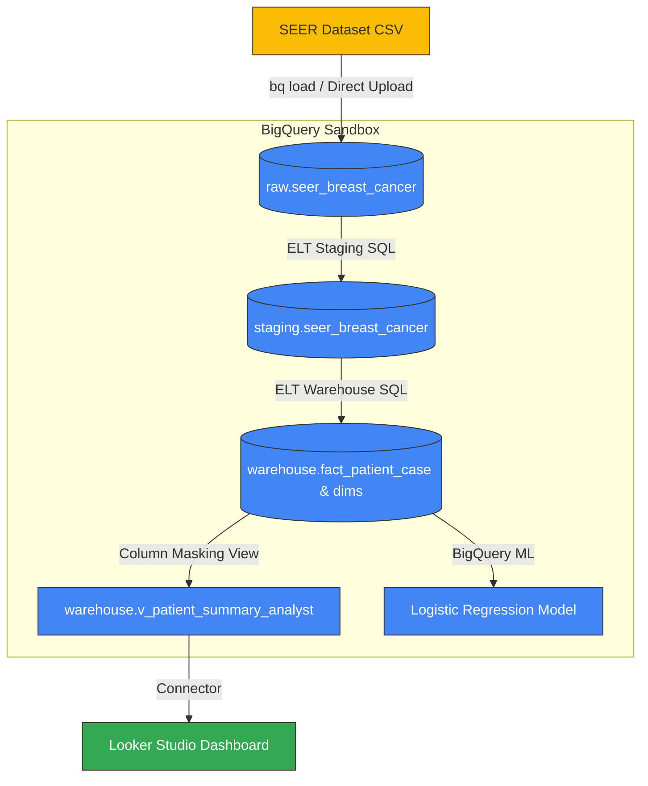

# Breast Cancer Survival Analytics Platform (Google Cloud BigQuery Sandbox Edition)

An end-to-end data engineering, analytics, and machine learning platform built on Google Cloud Platform, aligned with the **Associate Data Practitioner (ADP)** exam domains. This project demonstrates real-world clinical data pipelines, dimensional modeling, data governance, and predictive analytics using a de-identified public health dataset.

> [!IMPORTANT]
> **No-Billing Guardrail & Sandbox Constraints**
> - **Free Tier Execution**: This project runs entirely within the **BigQuery Sandbox** environment. No Google Cloud billing account, credit card, or payment registration is required.
> - **60-Day Expiration Policy**: Because it uses BigQuery Sandbox, all tables, views, and datasets are subject to Google's standard 60-day automatic expiration limit from their creation date. This is an expected sandbox lifecycle constraint. The permanent record of the project (schemas, SQL codes, queries, and dashboard screenshots) is preserved in the `/proof` folder.

---

## ADP Certification Domains Covered
1. **Data Preparation & Ingestion**: Direct-upload CSV ELT pipeline, staging cleansing, and casting.
2. **Storage & Data Modeling**: Staging and star-schema (fact/dimensions) dimensional modeling with clustering optimization.
3. **Governance & Security**: Simulated IAM controls, de-identification of data, and column-level masking via BigQuery Authorized Views (sandbox-compatible alternative to Data Catalog policy tags).
4. **Analytics & Machine Learning**: Correlation queries, Looker Studio dashboards, and predictive BigQuery ML (BQML) logistic regression modeling.

---

## Platform Architecture

---

## Technical Stack
- **Data Warehouse**: Google BigQuery (Sandbox Tier)
  * *Note: This project runs entirely within BigQuery Sandbox — no billing account or credit card required.*
- **Transformation Engine**: BigQuery Standard SQL (ELT Pattern)
- **Data Governance**: Authorized Views (Least-Privilege clinical masking)
- **Machine Learning**: BigQuery ML (BQML) - Logistic Regression
- **Visualization**: Looker Studio ([Live Dashboard Link](https://datastudio.google.com/reporting/958949e8-a4b9-44a6-b1fc-d76c0d8356d6))

---

## Data Pipeline Summary
1. **Ingestion**: Raw SEER Breast Cancer CSV uploaded directly into the `raw` dataset.
2. **Cleansing & Staging**: SQL transformations map and cast fields, standardize strings, and generate a surrogate clinical `patient_id` inside the `staging` dataset.
3. **Data Modeling**: A normalized star schema created inside the `warehouse` dataset with dimension tables (`dim_race`, `dim_marital_status`, `dim_stage`, `dim_tumor_grade`) clustered to optimize query scans.
4. **De-Identification View**: The authorized view `v_patient_summary_analyst` masks the sensitive `patient_id` column while exposing clinical facts for analysts and Looker Studio.
5. **Predictive Analytics**: A BigQuery ML Logistic Regression model is trained on clinical and demographic indicators to predict patient survival outcomes.

---

## Project Structure
- `/data/raw`: Raw input dataset (ignored in Git to comply with standard clinical data distribution).
- `/sql`: Production-grade versioned SQL scripts categorized by stages (`transformations`, `governance`, `analytics`, `ml`).
- `/docs`: Technical decisions (ELT, star schema modeling, sandbox substitutions, BQML evaluation).
- `/proof`: Permanent files showing schemas, query outputs, and dashboard views.

---

## Sandbox Constraints & Lifecycle Policy
Because this project runs in the BigQuery Sandbox tier, all datasets, tables, and views are subject to a **60-day expiration limit** from their creation date. To ensure this project remains demonstrable after the sandbox environment expires, a permanent record of schemas, ML metrics, and key query outputs is archived in the `/proof` folder.

---

## How to Verify
Please refer to the [How to Verify](#how-to-verify-project-permanence) section in the `/proof` documentation or check the `/proof` folder directly. The queries can be re-run in any Google Cloud project using the SQL scripts in `/sql/`.
